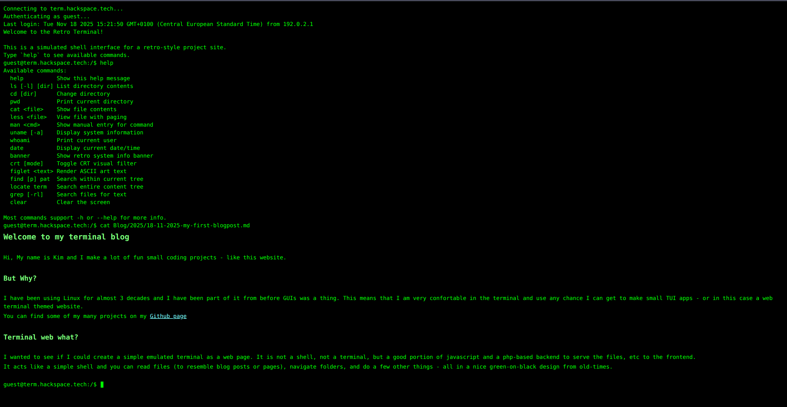

# Retro Terminal Website

*A fully interactive, filesystem-driven retro terminal website simulation (green-on-black Linux shell) built with PHP + JavaScript.*


*(Screenshot placeholder — replace with your own)*

---

## **📟 Overview**

This project is a web-based terminal emulation experience designed to look and feel like an old-school Linux shell running over SSH. Visitors interact with your site through simulated commands such as `ls`, `cd`, `cat`, `less`, and more. All content is stored in a simple folder structure and rendered dynamically — no CMS or database required.

Perfect for:

* Retro-styled personal websites
* Developer portfolios
* Documentation sites
* Easter-egg terminal interfaces
* Nostalgia projects

---

## **✨ Features**

### **🎛 Authentic Terminal Simulation**

* Fake SSH login sequence
* Realistic green-on-black CRT-style UI
* Blinking cursor, auto-scroll, editable prompt
* Command history (`↑` / `↓`)
* Tab completion for commands & filenames
* Markdown renderer with headings/lists/bold/italic, clickable links, and inline ANSI art
* Responsive layout recalculates pager height + ASCII art width on resize

### **📁 Filesystem-Driven Content**

Everything the user sees comes from the `content/` directory.

* Add folders → becomes directories in the terminal
* Add `.md` files → viewable via `cat` & `less`
* Add images → rendered as ASCII art
* MOTD loaded from `content/_meta/motd.md`

### **🧰 Commands Implemented**

| Command                 | Description                                     |
| ----------------------- | ----------------------------------------------- |
| `help`                  | Show available commands                         |
| `ls`, `ls -l`, `ls -lh` | Directory listing (with fake UNIX permissions)  |
| `cd`                    | Change directory                                |
| `pwd`                   | Print working directory                         |
| `cat <file>`            | Display text/markdown or ASCII-converted images |
| `less <file>`           | Full-screen pager with keyboard navigation      |
| `clear`                 | Clear screen                                    |

### **🖼 Image → ASCII Rendering**

Image files (`png`, `jpg`, `gif`, `webp`) automatically render in the terminal as ANSI-colored ASCII art using PHP GD.

---

## **📂 Project Structure**

```
retro-terminal/
├─ index.php
├─ api.php
├─ config.php
├─ content/
│  ├─ _meta/
│  │  └─ motd.md
│  ├─ About/
│  │  └─ About.md
│  └─ Projects/
│     └─ Projects.md
├─ assets/
│  ├─ css/terminal.css
│  └─ js/terminal.js
└─ README.md
```

---

## **🚀 Installation**

### **1. Requirements**

* PHP 7.4+
* PHP-GD extension (for ASCII image rendering)
* Web server (Apache, Nginx, Caddy, etc.)

### **2. Install**

Clone the repository:

```bash
git clone https://github.com/<yourname>/retro-terminal.git
cd retro-terminal
```

### **3. Deploy**

Place the project in any PHP-enabled webroot:

```
/var/www/html/retro-terminal/
```

Open in your browser:

```
http://localhost/retro-terminal/
```

Done 🎉

---

## **⚙️ Configuration**

All settings are in `config.php`:

```php
return [
  'content_root' => __DIR__ . '/content',
  'shell_user'   => 'guest',
  'shell_host'   => null, // defaults to domain
  'options' => [
      'enable_ansi_images' => true,
      'max_output_lines'   => 200
  ],
];
```

### Changing terminal identity:

```php
'shell_user' => 'kim',
'shell_host' => 'retrobox',
```

Prompt becomes:

```
kim@retrobox:/$
```

---

## **📑 Managing Content**

Content is **zero-config** and purely filesystem driven.

See **[CONTENT_GUIDE.md](CONTENT_GUIDE.md)** for detailed instructions.

Key points:

* Folders = directories (`ls`, `cd`)
* Markdown `.md` = viewable files (`cat`, `less`)
* Images = ASCII art (`cat image.png`)
* MOTD is read from `content/_meta/motd.md`

---

## **🛠 Development**

### JavaScript (Frontend)

* Terminal emulation
* Prompt handling
* Tab completion
* History
* Command parsing

### PHP (Backend)

* Directory listing
* Markdown/text loading
* Image → ASCII renderer
* Path sanitization / security

---

## **🧭 Roadmap**

See **[ROADMAP.md](ROADMAP.md)** for long-term plans.

Upcoming features include:

* Improved markdown rendering
* CRT bloom / glow modes
* Custom themes
* “man pages” for commands
* Sound effects (optional)

---

## **📜 License**

MIT License — free to use, modify, and share.

---

## **❤️ Contributing**

PRs, issues, and feature requests are welcome!

If you use this in a personal site or portfolio, please share — it’s always cool to see how others extend the terminal experience.
